msiAssess
================

<!-- README.md is generated from README.Rmd. Please edit that file -->

<!-- badges: start -->

<!-- badges: end -->

msiAssess allows the user to fit a set of Bayesian models for
multi-species (biodiversity) indicators to both simulated and empirical
data. The models will be explained in detail elsewhere, but include a
version of Freeman’s “generic method” ([S. N. Freeman et al.,
2021](#ref-freemanGenericMethod2021)) that allows for variably observed
species’ index standard errors, and a Bayesian version of Soldaat’s
Monte Carlo method ([L. L. Soldaat et al.,
2017](#ref-soldaatMonteCarlo2017)) with user-controlled in-model
imputation of missing data. Two novel Bayesian model types (“no pooling”
and “partial pooling” models of growth-rates with common annual
species-level “shocks”) are also included for comparative purposes.

The simulation framework gives the user control over a range of
parameters, and allows for the inclusion of missingness patterns that
are “Missing Not At Random” (MNAR) as a test of how the different MSIs
perform when their assumptions (e.g. species Missing At Random \[MAR\]
conditional on the model structure) are violated to varying degrees, as
is quite common when heterogeneous data sources are combined in MSIs,
and/or when species time-series exhibit strong time-varying biases (e.g.
R. J. Boyd et al. ([2025](#ref-boydUsingCausal2025))).

## Basic usage

A wrapper function `run_full_analysis()` is provided for convenience,
although the constituent parts can also be run separately. For simulated
data, it is most convenient to specify the simulation settings via a
list that is then passed to `run_full_analysis()`.

``` r
## Specify simulation settings
sim_args <- list(n_species = 40, n_years = 30, seed = 232680,
                 ## Growth rate data-generating process (DGP)
                 dgp_mode = "spline", # "spline","rw","ar1","changepoint","seasonal","mixture"
                 ## DGP options (sub-options apply to specific DGPs as stated)
                 # spline options
                 df_mu = 6, # default
                 # RW / AR1
                 sigma_eta = 0.05, phi = 0.7,
                 # changepoint
                 n_cp = 2, jump_sd = 0.15, piecewise_linear = FALSE,
                 # seasonal
                 A = 0.15, period = 8, phi0 = runif(1, 0, 2*pi),
                 # mixture of random walks
                 K_guilds = 5, # number of groups
                 # time-series entry mode
                 entry_mode = c("none"),
                 ## Simulate species/observation options (cross-DGP)
                 # species/state variation
                 sigma_sp = 0.05, sigma_delta = 0.05, sd_alpha0 = 0.4,
                 innov_dist = "normal", df_u = 3, # "normal" or "student_t" (df_u for t only)
                 sp_trend = "none", # "none" or "random_slope"
                 sigma_gamma = 0.05, log_sd_se = 0.35, 
                 use_delta = FALSE, # cross-species annual shocks?
                 # observation model
                 sigma_obs_mean = 0.02, prop_missing = 0,
                 # Inclusion MNAR (additional to prop_missing)
                 inclusion_bias = list(enabled = FALSE, # include inclusion bias?
                                       a0 = -0.4, # parameters for Bernoulli model of MNAR bias
                                       a1 = 3.0,
                                       rho1 = 1.2,
                                       rho0 = 0.2,
                                       p_init = 1))
```

These will be described in more detail when the code is incorporated
into an R package, although inspection of the `generate_mu()` and
`simulate_species_data()` functions’ code should make it clear what each
option is doing.

The other options passed to `run_full_analysis()` are briefly described
in code comments below.

``` r
out <- run_full_analysis(data_source = "simulate", # simulated data or empirical?
                         sim_args = sim_args, # as above
                         # which models to run?
                         fit_models = c("partial","freeman", "nopool","bayes_geomean"),
                         ## Model-specific settings
                         jags_partial = list(df_mu=6, obs_var_model=2, n_iter=500, n_burn=100),
                         jags_nopool = list(df_mu=6, obs_var_model=2, n_iter=500, n_burn=100),
                         jags_freeman = list(obs_var_model=2, n_iter=500, n_burnin=100),
                         jags_bayes_geomean = list(obs_var_model=2, n_iter=500, n_burnin=100),
                         # smoothed version of Bayesian geomean?
                         smooth_geomean = list(enable = TRUE, prefer_freeman_basis = FALSE),
                         plot_geomean = TRUE, # plot unsmoothed Bayes geomean MSI
                         # impute missing spp/year combinations
                         impute_all_geomean = T, # if false, then under MNAR this estimand differs from other models
                         plot_MNAR = TRUE, # plot sampled-only truth alongside *actual* truth
                         ## Cross-model settings
                         # legacy seFromData overridden by model-specific obs_var_model settings, seFromData = T (or F) sets obs_var_model = 2 (or 4
                         # but only if obs_var_model not specified
                         brc_opts = list(num_knots=12, seFromData=TRUE, Y1perfect=TRUE, m.scale = "loge"),
                         ## Growth-rate presentation scale (model returns both anyway, this is for plot)
                         growth_scale = "log",
                         quiet = TRUE) # suppress JAGS output here 
```

## “Perfect” data scenario (no missingness)

In this example we are using a spline-based data-generating process
(DGP) for the underlying growth rates. This is congenial to the actual
models (i.e. the DGP assumed by the models is actually true). We are not
including any MNAR missingness, or any missingness at all. In general we
expect all models to index “truth” very closely in this scenario.
Indeed, all models overlie the “truth” for all metrics with high
confidence. (Note that these examples are all run with very short MCMC
chains.)

``` r
# Check convergence (preview only)
head(out$checks$freeman$bad) # all models are included at out$checks level
```

    NULL

``` r
# Indicator plots
print(out$plots$MSI) # M_prime equivalents
```

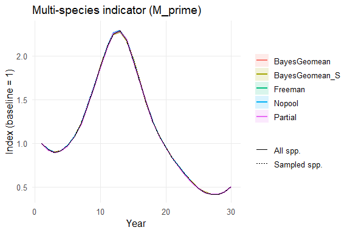

``` r
print(out$plots$CumLog) # M equivalents where applicable
```

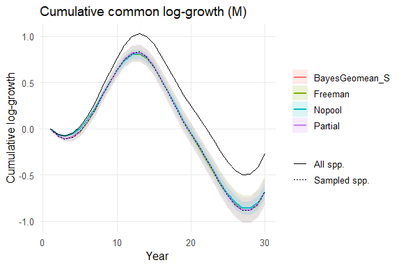

``` r
print(out$plots$Growth) # annual growth on scale specified in run_full_analysis()
```

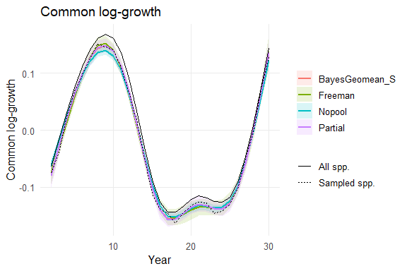

``` r
# Inclusion diagnostics (e.g. for comparing MNAR strength to empirical examples)
evaluate_inclusion_process(out$sim) # Not informative for perfect sample with no drop-out
```

    $transition
    $transition$p11
    [1] 1

    $transition$p00
    [1] NA

    $transition$pi
    [1] 1

    $transition$Ein
    [1] Inf

    $transition$Eout
    [1] NA


    $run_lengths_in
     [1] 30 30 30 30 30 30 30 30 30 30 30 30 30 30 30 30 30 30 30 30 30 30 30 30 30
    [26] 30 30 30 30 30 30 30 30 30 30 30 30 30 30 30

    $run_lengths_out
    integer(0)

    $burstiness_in
    [1] -1

    $burstiness_out
    [1] NA

    $entry_stats
    $entry_stats$FY
     [1] 1 1 1 1 1 1 1 1 1 1 1 1 1 1 1 1 1 1 1 1 1 1 1 1 1 1 1 1 1 1 1 1 1 1 1 1 1 1
    [39] 1 1

    $entry_stats$LY
     [1] 30 30 30 30 30 30 30 30 30 30 30 30 30 30 30 30 30 30 30 30 30 30 30 30 30
    [26] 30 30 30 30 30 30 30 30 30 30 30 30 30 30 30

    $entry_stats$duration
     [1] 30 30 30 30 30 30 30 30 30 30 30 30 30 30 30 30 30 30 30 30 30 30 30 30 30
    [26] 30 30 30 30 30 30 30 30 30 30 30 30 30 30 30

    $entry_stats$prop_never_observed
    [1] 0

    $entry_stats$prop_enter_after_1
    [1] 0

    $entry_stats$mean_FY
    [1] 1

    $entry_stats$median_FY
    [1] 1

    $entry_stats$mean_duration
    [1] 30

    $entry_stats$median_duration
    [1] 30


    $trend_entry
    NULL

    $cor_I_r_by_year
     [1] NA NA NA NA NA NA NA NA NA NA NA NA NA NA NA NA NA NA NA NA NA NA NA NA NA
    [26] NA NA NA NA

    $diagnostics
       year n_pairs sd_I sd_r            reason
    1     2      40    0    0 no_variation_both
    2     3      40    0    0 no_variation_both
    3     4      40    0    0 no_variation_both
    4     5      40    0    0 no_variation_both
    5     6      40    0    0 no_variation_both
    6     7      40    0    0 no_variation_both
    7     8      40    0    0 no_variation_both
    8     9      40    0    0 no_variation_both
    9    10      40    0    0 no_variation_both
    10   11      40    0    0 no_variation_both
    11   12      40    0    0 no_variation_both
    12   13      40    0    0 no_variation_both
    13   14      40    0    0 no_variation_both
    14   15      40    0    0 no_variation_both
    15   16      40    0    0 no_variation_both
    16   17      40    0    0 no_variation_both
    17   18      40    0    0 no_variation_both
    18   19      40    0    0 no_variation_both
    19   20      40    0    0 no_variation_both
    20   21      40    0    0 no_variation_both
    21   22      40    0    0 no_variation_both
    22   23      40    0    0 no_variation_both
    23   24      40    0    0 no_variation_both
    24   25      40    0    0 no_variation_both
    25   26      40    0    0 no_variation_both
    26   27      40    0    0 no_variation_both
    27   28      40    0    0 no_variation_both
    28   29      40    0    0 no_variation_both
    29   30      40    0    0 no_variation_both

    $note
    [1] "All annual selection–growth correlations are NA for T-1 = 29. This is expected when inclusion or growth lacks cross-species variation (e.g., cohort entry with all zeros early on). Reason summary: [no_variation_bothx29]. Source of r: mu_true + delta_true (+ gamma_s)."

``` r
## Spp trends (grey line = latent process; blue dot = noisy obs with missingness
# Plot 12 randomly chosen species on log scale
plot_species_trends(out, n_sample = 12, scale = "log")
```

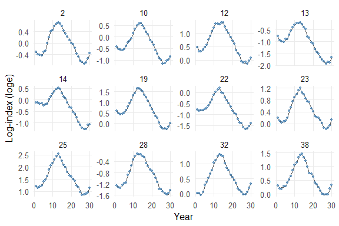

``` r
# Plot specific species (by index) as baseline-1 indices
plot_species_trends(out, species = c(1, 5, 9), scale = "index")
```

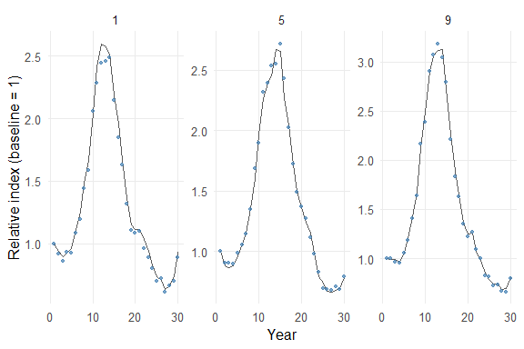

## “Imperfect” data scenario (MNAR missingness)

Note that here missing species/year index combinations are being imputed
for the Bayesian geomean (`impute_all_geomean = T`). If we switched this
to `FALSE`, then the estimand is no longer comparable to the other
methods.

``` r
sim_args <- list(n_species = 100, n_years = 30, seed = 232680,
                 ## Growth rate DGP
                 dgp_mode = "mixture",
                 ## DGP options for mixture
                 # RW / AR1
                 sigma_eta = 0.05, phi = 0.7,
                 # mixture of random walks
                 K = 5, # number of groups
                 # time-series entry mode
                 entry_mode = c("none"),
                 ## Simulate species options
                 # species/state variation
                 sigma_sp = 0.05, sigma_delta = 0.05, sd_alpha0 = 0.4,
                 innov_dist = "normal", df_u = 3, # "normal" or "student_t" (df_u for t)
                 sp_trend = "random_slope", sigma_gamma = 0.05, log_sd_se = 0.35, # random slopes this time
                 use_delta = FALSE, # cross-species annual shocks?
                 # observation model
                 sigma_obs_mean = 0.05, prop_missing = 0.2,
                 # Inclusion MNAR (additional to prop_missing)
                 inclusion_bias = list(enabled = TRUE, # include inclusion bias?
                                       a0 = -0.5, 
                                       a1 = 3.0,
                                       rho1 = 1.5,
                                       rho0 = 0.1,
                                       p_init = 1))
out <- run_full_analysis(data_source = "simulate",
                         sim_args = sim_args,
                         fit_models = c("partial","freeman", "nopool", "bayes_geomean"),
                         ## Model-specific settings (ovm = 2)
                         jags_partial = list(df_mu=6, obs_var_model=4, n_iter=500, n_burn=100),
                         jags_nopool = list(df_mu=6, obs_var_model=4, n_iter=500, n_burn=100),
                         jags_freeman = list(obs_var_model=4, n_iter=500, n_burnin=100),
                         jags_bayes_geomean = list(obs_var_model=4, n_iter=500, n_burnin=100),
                         # smoothed version of Bayesian geomean?
                         smooth_geomean = list(enable = TRUE, prefer_freeman_basis = FALSE),
                         plot_geomean = TRUE, # plot unsmoothed Bayes geomean MSI
                         # impute missing spp/year combinations
                         impute_all_geomean = T, # if false, then under MNAR this estimand differs from other models
                         ## Cross-model settings (seFromData not really needed here as ovm = 2 above)
                         brc_opts = list(num_knots=12, seFromData=TRUE, Y1perfect=FALSE, m.scale = "loge"),
                         ## Growth-rate presentation scale
                         growth_scale = "log",
                         quiet = TRUE) # suppress JAGS output to console

# Indicator plots
print(out$plots$MSI) # M_prime equivalents
```

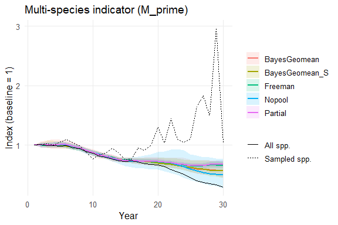

``` r
print(out$plots$CumLog) # M equivalents where applicable
```

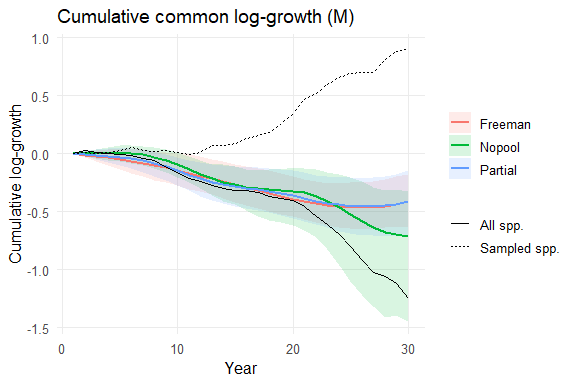

``` r
print(out$plots$Growth) # annual growth on scale specified in run_full_analysis()
```

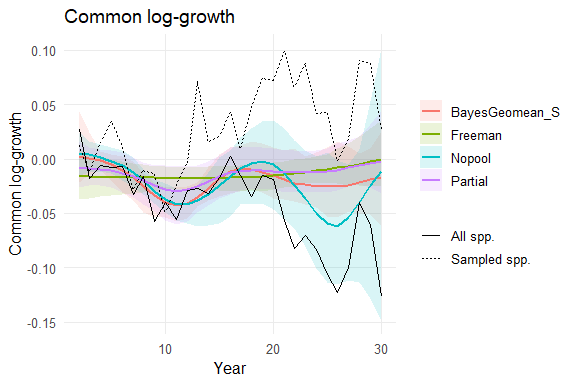

``` r
# Inclusion diagnostics (e.g. for comparing MNAR strength to empirical examples)
evaluate_inclusion_process(out$sim)
```

    $transition
    $transition$p11
    [1] 0.59

    $transition$p00
    [1] 0.652

    $transition$pi
    [1] 0.463

    $transition$Ein
    [1] 2.44

    $transition$Eout
    [1] 2.87


    $run_lengths_in
      [1] 11  1  3  1  3  1  1  4  1  1  3  1  1  2  1  2  3  4  2  1  7  2  3  1  2
     [26] 10  1  2  1  4  8  3  1  2  3  2  2  3  6  3  2  3  3  2  4  2  2  1  1  4
     [51]  1  1  3  2  1  2  1  6  2  1  1  2  1  1  3  1  1  2  2  3  1  1  1  1  2
     [76]  2  1  1  3  1  2  1  1  1  5  2  1  2  1  1  1  1  3  2  1  4  4  3  6  5
    [101]  8  2  4  1  1  1  2  7  1  1  1  1  9  1  2  1  1  4  8  2  1  1  1  1  2
    [126]  1  2  2  1  2  1  5  1  1  2  1  1  1  3  3  3  1  2  1  2  5  2  2  1  1
    [151]  1  1  5  4  3  2  1  1  1  1  1  5  2  3  1 12  8  3  3  1  1 14  5  2  4
    [176]  1  2  1  1  8  1  1  2  4  1  1  2  1  2  3  2  1  1  5  1  2  3  3  7  2
    [201]  2  3  2  2  1  1  1  3  1  1  1  1  1  1  1  1  1  1  2  1  2  5  1  2  2
    [226]  6  7  2  1  2  1  6  1  3  2  2  2  6  4  1  1  1  3  3  3  1  1  1  1  1
    [251]  1  1  1  2  1  1  2  5  2  3  3 12  2  9  2  1  1  3  2  3  1  2  3  3  2
    [276]  6  3  2  1  2  5  2  1  1  4  3  3  3  1  3  3  1  7  1  2  2  1  4  2  4
    [301]  1  1  2  1  2  4  1  1  2  5  4  1  1  1  7  2  4 10  1  1  1  1  1  4  2
    [326]  1  1  2  1  1  9  1  1  3  1  1  1  2  1  3  1  1  1  5  3  6  5  1  1  1
    [351]  1  5  1  1  1  1  3  1  1  2  1  1  4  1  1  2  2  2  1  2  2  2  4  2  2
    [376]  2  1  2  5  1  3  3  3  1  5  1  9  1  2  1  1  1  2  2  7  2  1  1  2  1
    [401]  1  1  1  3  2  3  1  2  2  2  2  1  4  6  1  1  1  1  2  1  1  1  1  2  5
    [426]  1  1  3  1  1  1  7  1  2  1  1  1 16  1  7  1  1  1  1  2  4  3  4  2  5
    [451]  1  2  2  4  1  2  1  1  1  1  1  1  1  3  1  1  1  5  2  1  1  1  1  1  6
    [476]  1  3  1  1  2  7  3  2  3  1  5  1  2  1  2  1  1  3  3  1  2  2  3  2  3
    [501]  1  1  1  1  5  2  5  2  3  2  1  1  1  1  3  1  2  2  4  2  4  2  1  3  2
    [526]  2  1  4 10  3  4  1  3  2  3  1  1  1  1  8  1  1  2  4  4  4  1  1  2  1
    [551]  5  1  1  1  2  6  1  9  1  2  3  2  4  1  7  1  3  3  2  1  1  2  1  3  2
    [576]  1  1  1  7  2  4  1  2  1  2  3  2  2  1  3  2  3  5  2  1  1  3  1  3  1
    [601]  1  3  3  1  1  3  3  3  2  1

    $run_lengths_out
      [1]  3  2  3  1  1  1  2  3  4 13  2  4  6  2  4  2  1  1  3  3  1  2  1  1  8
     [26]  3  2  5  1  1  1  1  2  2  1  2  2  3  5  4  1  2  5  2  3  2  1  3  2  2
     [51]  3  2  1  2  2  4  3  1  9  2  1  1  1  3  1  1  1  1  1  1  1  1  1  1  4
     [76]  1 20  3  2  1  1  1  1  3  2  2  1  1 13  5  1  2  1  7  1  3  1  1  3  1
    [101]  1  3  3  5  6  3  1  4  2  5  1  2  2  4  1  2  2  7  2  3  5  2  6  2  2
    [126]  1  2  4  6  1  1  8  3  4  1  1  1  7  1  3  4  5  1  4  1  1  1  1  2  4
    [151]  1  2  1  2  3  2  4  1  1  4  9  3  2  3  1  6  8  3  1  6  2  1  7  3  1
    [176]  9  2  1  2  2  1  3  2  1 10  5  1  1  1  1  1  2  2  3  1  4  3  1  1  9
    [201]  2  1  3  1  1  5  2  3  1  6  2  1  4  5  1  3  4  1  1  1  3  1  2  1  2
    [226]  2  1  1  4  1  2  1  1  1  1 16  3  1  2  5  6  1  2  1  1  1  3  4  1  1
    [251]  1  1  1  4  3  3  2  1  2  1  5  3  2  4  1  1  2  1  7  1  2  2  4 14  1
    [276]  1  1  7  7  5  3  1  3  1  3  4  2  1  1  2  3  1  1  4  4  3  4  1  4  1
    [301]  2  1  1  2  3  3  4  1  5  4  2  2  1  1  3  1  1  4  6  1  1  7  1  2  3
    [326]  1  1  1  1  6  3  1  3  7  8  2  1  5  7  1  2  3  2  1  1  4  1  1  3 10
    [351]  5  4  1  1  2  1  6  6  2  1  1  3  1  2  3  1  1  6  2  1  7  2  1 15  1
    [376]  8  2  1  1  1  1  3  2  1  4  1  2  2  1  3  2  1  1  1  1  1  1  1  2  3
    [401]  1  2 13  6  2  3  1  1  3  1  3  3  1  2  1  3  3  4  8  4  3  1  1  2  8
    [426]  1  1  2  1  3  1  1 10  1  1  1  1  2  1  2  5  1  4  6  2  7  7  1  3  1
    [451]  4  2  1  1  2  2  2  1  1  4  1  1  1  1  3  5  3  1  4  1  4  6  2  2 11
    [476]  3  6  3  4  1  6  2  1  5  6  8  2 13  3  1  1  3 13  1  2  6  4  2  1  1
    [501]  1  1  3  3  1  1  2  1  1  1  1  1  4  1  1  1  1  7  5  1  2  4  2  1  2
    [526]  1  2  4  2  1  4  1  1  2  3  2  3  3  4  1  1  1  4  1  9  1  2  4  6  1
    [551]  2  7  1  1  5  2  1  2  1  1  1  2  2  3 13  5  1  1  3  2  1  2  2  3  2
    [576]  1  1  1  1  1  2  2  5  4  1  2

    $burstiness_in
    [1] -0.079

    $burstiness_out
    [1] -0.045

    $entry_stats
    $entry_stats$FY
      [1] 1 2 1 1 1 3 1 1 1 1 1 1 1 1 1 1 1 1 1 1 1 1 1 1 1 1 1 1 1 1 1 1 1 1 1 1 2
     [38] 1 2 2 1 1 1 1 1 3 1 1 1 1 1 1 1 1 5 1 1 2 1 1 2 1 3 1 1 1 1 1 2 7 4 1 5 1
     [75] 1 1 1 1 2 1 1 1 1 9 1 1 1 1 1 1 2 1 1 1 1 2 2 1 1 2

    $entry_stats$LY
      [1] 30 17 28 28 30 30 27 25 28 30 30 29 10 30 25 29 30 24 30 30 28 30 27 30 30
     [26] 30 30 30 28 22 23 30 30 30 30 30 30 25 27 26 14 29 27 30 30 26 30 16 23 27
     [51] 29 26 30 30 29 30 29 23 23 30 26 24 27 30 15 30 28 29 17 29 30 30 22 30 28
     [76] 28 30 29 27 26 30 30 24 17 30 29 30 29 23 30 30 30 30 28 29 29 17 30 30 28

    $entry_stats$duration
      [1] 30 16 28 28 30 28 27 25 28 30 30 29 10 30 25 29 30 24 30 30 28 30 27 30 30
     [26] 30 30 30 28 22 23 30 30 30 30 30 29 25 26 25 14 29 27 30 30 24 30 16 23 27
     [51] 29 26 30 30 25 30 29 22 23 30 25 24 25 30 15 30 28 29 16 23 27 30 18 30 28
     [76] 28 30 29 26 26 30 30 24  9 30 29 30 29 23 30 29 30 30 28 29 28 16 30 30 27

    $entry_stats$prop_never_observed
    [1] 0

    $entry_stats$prop_enter_after_1
    [1] 0.2

    $entry_stats$mean_FY
    [1] 1.43

    $entry_stats$median_FY
    [1] 1

    $entry_stats$mean_duration
    [1] 26.82

    $entry_stats$median_duration
    [1] 29


    $trend_entry
    NULL

    $cor_I_r_by_year
     [1] 0.037 0.195 0.247 0.147 0.127 0.125 0.050 0.221 0.034 0.145 0.210 0.397
    [13] 0.156 0.227 0.165 0.247 0.175 0.359 0.457 0.363 0.459 0.320 0.338 0.361
    [25] 0.394 0.461 0.455 0.355 0.319

    $diagnostics
       year n_pairs sd_I sd_r reason
    1     2     100 0.50 0.07     ok
    2     3     100 0.50 0.08     ok
    3     4     100 0.49 0.10     ok
    4     5     100 0.50 0.10     ok
    5     6     100 0.50 0.08     ok
    6     7     100 0.50 0.09     ok
    7     8     100 0.50 0.08     ok
    8     9     100 0.50 0.12     ok
    9    10     100 0.50 0.12     ok
    10   11     100 0.50 0.12     ok
    11   12     100 0.50 0.18     ok
    12   13     100 0.50 0.18     ok
    13   14     100 0.50 0.14     ok
    14   15     100 0.50 0.11     ok
    15   16     100 0.50 0.15     ok
    16   17     100 0.50 0.17     ok
    17   18     100 0.50 0.18     ok
    18   19     100 0.50 0.23     ok
    19   20     100 0.50 0.21     ok
    20   21     100 0.50 0.23     ok
    21   22     100 0.50 0.21     ok
    22   23     100 0.50 0.26     ok
    23   24     100 0.50 0.26     ok
    24   25     100 0.50 0.27     ok
    25   26     100 0.50 0.29     ok
    26   27     100 0.50 0.27     ok
    27   28     100 0.50 0.26     ok
    28   29     100 0.47 0.26     ok
    29   30     100 0.50 0.27     ok

    $note
    NULL

``` r
## Spp trends (grey line = latent process; blue dot = noisy obs with missingness
# Plot 12 randomly chosen species on log scale
plot_species_trends(out, n_sample = 12, scale = "log")
```

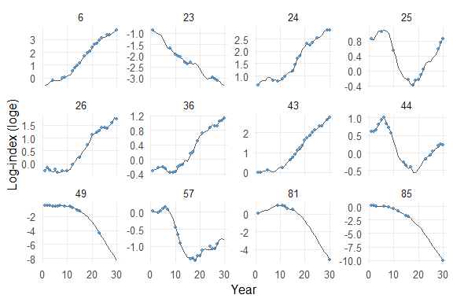

``` r
# Plot specific species (by index) as baseline-1 indices
plot_species_trends(out, species = c(1, 5, 9), scale = "index")
```

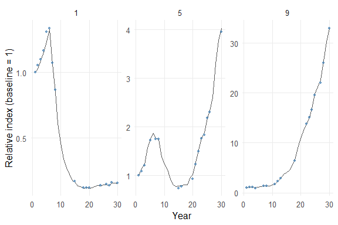

And the same model run without the imputation for the Bayesian geomean:

``` r
out2 <- run_full_analysis(data_source = "simulate",
                         sim_args = sim_args,
                         fit_models = c("partial","freeman", "nopool", "bayes_geomean"),
                         ## Model-specific settings (ovm = 2)
                         jags_partial = list(df_mu=6, obs_var_model=4, n_iter=500, n_burn=100),
                         jags_nopool = list(df_mu=6, obs_var_model=4, n_iter=500, n_burn=100),
                         jags_freeman = list(obs_var_model=4, n_iter=500, n_burnin=100),
                         jags_bayes_geomean = list(obs_var_model=4, n_iter=500, n_burnin=100),
                         # smoothed version of Bayesian geomean?
                         smooth_geomean = list(enable = TRUE, prefer_freeman_basis = FALSE),
                         plot_geomean = TRUE, # plot unsmoothed Bayes geomean MSI
                         # impute missing spp/year combinations
                         impute_all_geomean = FALSE, # if false, then under MNAR this estimand differs from other models
                         ## Cross-model settings (seFromData not really needed here as ovm = 2 above)
                         brc_opts = list(num_knots=12, seFromData=TRUE, Y1perfect=FALSE, m.scale = "loge"),
                         ## Growth-rate presentation scale
                         growth_scale = "log",
                         quiet = TRUE) # suppress JAGS output to console

# Indicator plots
print(out2$plots$MSI) # M_prime equivalents
```

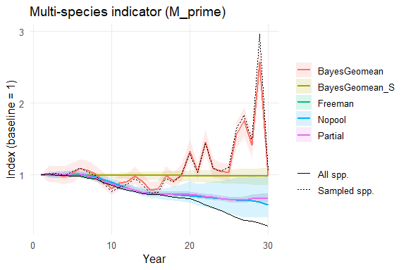

``` r
print(out2$plots$CumLog) # M equivalents where applicable
```

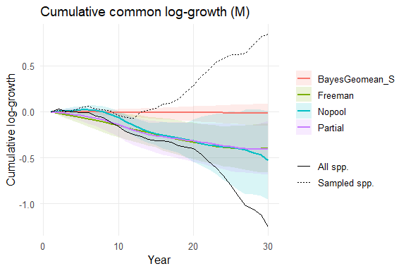

``` r
print(out2$plots$Growth) # annual growth on scale specified in run_full_analysis()
```

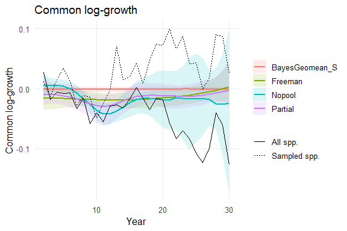

## Comparing `msiAssess` to `BRCIndicators` Freeman implementation

Here we take the simulated MNAR data above and run both the Freeman
model from `BRCindicators` and the `msiAssess` implementation with the
same settings. Allowing for minor differences in implementation (largely
those designed to provide `msiAssess` with more flexibility to handle
variably missing SEs and species’ time-series entry points), the
`msiAssess` method essentially returns the same result (note that
ordinary Monte Carlo error will also be evident in short MCMC runs like
those given here).

``` r
# assume out2$sim$y  is S × T  matrix of log indices
Y <- out2$sim$y
years <- out2$sim$years
species <- rownames(Y) %||% paste0("sp", seq_len(nrow(Y)))
colnames(Y) <- paste0("year.", years)
df_wide <- data.frame(species = species, Y)
df_long <- reshape(df_wide,
                   direction = "long",
                   varying = list(names(df_wide)[-1]),
                   v.names = "index",
                   timevar = "year",
                   times = years)
row.names(df_long) <- NULL
head(df_long, n = 3); tail(df_long, n = 3)
```

      species year       index id
    1     sp1    1 -0.04473837  1
    2     sp2    1          NA  2
    3     sp3    1  0.24794130  3

         species year     index  id
    2998    sp98   30  1.284345  98
    2999    sp99   30 -3.132135  99
    3000   sp100   30        NA 100

``` r
# run data through BRCindicators
mod <- BRCindicators::bma(data = df_long, 
                          num.knots = 12, m.scale = "loge",
                          parallel = TRUE,
                          seFromData = FALSE,
                          Y1perfect = TRUE,
                          plot = FALSE,
                          n.iter = 1000, seed = 232680)
```


    Processing function input....... 

    Done. 
     
    Beginning parallel processing using 11 cores. Console output will be suppressed.

    Parallel processing completed.

    Calculating statistics....... 

    Done. 

``` r
# Rerun msiAssess for comparability
out3 <- run_full_analysis(data_source = "simulate",
                          # same settings as used for out2 model above
                         sim_args = sim_args,
                         fit_models = "freeman",
                         # for comparability with BRCindicators settings (burn in = floor(n.iter/2))
                         jags_freeman = list(obs_var_model=4, n_iter=1000, n_burnin=500),
                         brc_opts = list(num_knots=12, seFromData=FALSE, Y1perfect=TRUE, m.scale = "loge"),
                         quiet = TRUE)

## Extract msiAssess Freeman Mprime summary (log scale, posterior_summary structure)
mpr <- out3$results$freeman$Mprime

# Convert to index scale, baseline = 100 at first year
mpr_med <- as.numeric(mpr$median)
mpr_lower <- as.numeric(mpr$lower)
mpr_upper <- as.numeric(mpr$upper)
idx_freeman_med <- (exp(mpr_med   - mpr_med[1]))*100
idx_freeman_lower <- (exp(mpr_lower - mpr_med[1]))*100
idx_freeman_upper <- (exp(mpr_upper - mpr_med[1]))*100

## Base plot: BRCIndicators Mprime index
yr <- mod$Year
plot(yr, mod$Index.Mprime,
     type = "l", lwd = 2,
     xlab = "Year", ylab = "Index (baseline = 100)",
     ylim = range(c(mod$Index.Mprime, mod$lowerCI.Mprime, mod$upperCI.Mprime, idx_freeman_lower, idx_freeman_upper), na.rm = TRUE))
legend("topright",
       legend = c("BRCIndicators Freeman", "BRCIndicators Freeman (95% CI)", "msiAssess Freeman (median)", "msiAssess Freeman (95% CI)"),
       col    = c("black", "black", "red", "red"),
       lwd    = c(2, 1, 2, 1),
       lty    = c(1, 2, 1, 2),
       bty    = "n")
## Add BRCIndicator CIs and Freeman msiAssess curve + 95% bands
lines(yr, mod$lowerCI.Mprime, col = "black", lty = 2)
lines(yr, mod$upperCI.Mprime, col = "black", lty = 2)
lines(yr, idx_freeman_med, col = "red", lwd = 2)
lines(yr, idx_freeman_lower, col = "red", lty = 2)
lines(yr, idx_freeman_upper, col = "red", lty = 2)
```

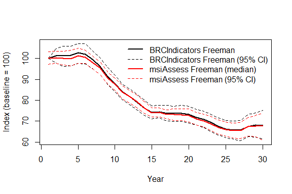
Look at Rhat stats for `msiAssess` model run; not available for
`BRCIndicators`: see issue
[here](https://github.com/BiologicalRecordsCentre/BRCindicators/issues/90).
It’s worth noting here that the global SE parameter, `theta`, is far
from converging. The same behaviour has been observed with an empirical
dataset with longer chains (`n_iter = 1000`).

``` r
head(out3$checks$freeman$table[,c(8:10)], n = 5)
```

                 Rhat n.eff    param
    deviance 3.187187     4 deviance
    theta    3.134380     4    theta
    b[11]    1.200830   300    b[11]
    b[10]    1.195896   300    b[10]
    b[1]     1.185482   150     b[1]

## References

<div id="refs" class="references csl-bib-body hanging-indent"
entry-spacing="0" line-spacing="2">

<div id="ref-boydUsingCausal2025" class="csl-entry">

R. J. Boyd et al. (2025).*Using causal diagrams and superpopulation
models to correct geographic biases in biodiversity monitoring data*.
Methods in Ecology and Evolution. 16, 2, 332–344.
doi:[10.1111/2041-210X.14492](https://doi.org/10.1111/2041-210X.14492)

</div>

<div id="ref-freemanGenericMethod2021" class="csl-entry">

S. N. Freeman et al. (March 2021).*A Generic Method for Estimating and
Smoothing Multispecies Biodiversity Indicators Using Intermittent Data*.
Journal of Agricultural, Biological and Environmental Statistics. 26, 1,
71–89.
doi:[10.1007/s13253-020-00410-6](https://doi.org/10.1007/s13253-020-00410-6)

</div>

<div id="ref-soldaatMonteCarlo2017" class="csl-entry">

L. L. Soldaat et al. (October 2017).*A Monte Carlo method to account for
sampling error in multi-species indicators*. Ecological Indicators. 81,
340–347.
doi:[10.1016/j.ecolind.2017.05.033](https://doi.org/10.1016/j.ecolind.2017.05.033)

</div>

</div>
