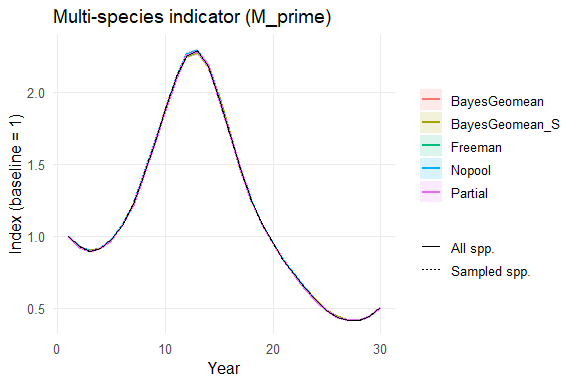
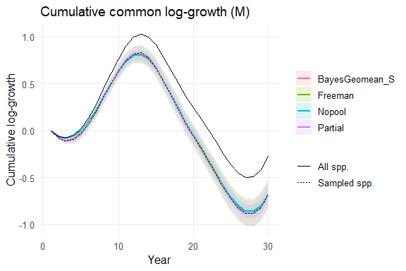
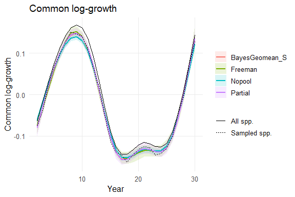
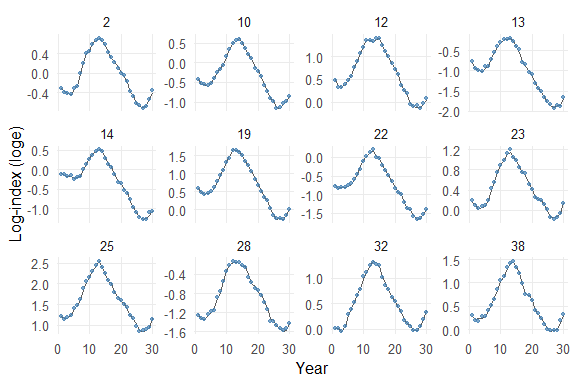
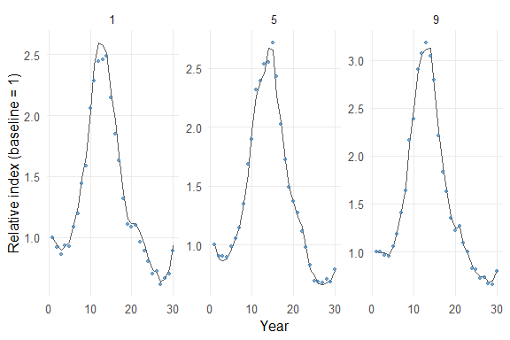

msiAssess
================

<!-- README.md is generated from README.Rmd. Please edit that file -->

<!-- badges: start -->

<!-- badges: end -->

msiAssess allows the user to fit a set of Bayesian models for
multi-species (biodiversity) indicators to both simulated and empirical
data. The models will be explained in detail elsewhere, but include a
version of the Freeman’s “generic method” ([S. N. Freeman et al.,
2021](#ref-freemanGenericMethod2021)) that allows for variably observed
species’ index standard errors, and a Bayesian version of Soldaat’s
Monte Carlo method ([L. L. Soldaat et al.,
2017](#ref-soldaatMonteCarlo2017)) with user-controlled in-model
imputation of missing data. Two novel Bayesian model types (“no pooling”
and “partial pooling” models of growth-rates with common annual
species-level “shocks”) are also included for comparative purposes.

The simulation framework gives the user control over a range of
parameters, and allows for the inclusion of missingness patterns that
are “Missing Not At Random” (MNAR) as a test of how the different MSIs
perform when their assumptions (e.g. species Missing At Random \[MAR\]
conditional on the model structure) are violated to varying degrees, as
is quite common when heterogeneous data sources are combined in MSIs,
and/or when species time-series exhibit strong time-varying biases (e.g.
R. J. Boyd et al. ([2025](#ref-boydUsingCausal2025))).

## Basic usage

A wrapper function `run_full_analysis()` is provided for convenience,
although the constituent parts can also be run separately. For simulated
data, it is most convenient to specify the simulation settings via a
list that is then passed to `run_full_analysis()`.

``` r
## Specify simulation settings
sim_args <- list(n_species = 40, n_years = 30, seed = 232680,
                 ## Growth rate data-generating process (DGP)
                 dgp_mode = "spline", # "spline","rw","ar1","changepoint","seasonal","mixture"
                 ## DGP options (sub-options apply to specific DGPs as stated)
                 # spline options
                 df_mu = 6, # default
                 # RW / AR1
                 sigma_eta = 0.05, phi = 0.7,
                 # changepoint
                 n_cp = 2, jump_sd = 0.15, piecewise_linear = FALSE,
                 # seasonal
                 A = 0.15, period = 8, phi0 = runif(1, 0, 2*pi),
                 # mixture of random walks
                 K_guilds = 5, # number of groups
                 ## Simulate species/observation options (cross-DGP)
                 # species/state variation
                 sigma_sp = 0.05, sigma_delta = 0.05, sd_alpha0 = 0.4,
                 innov_dist = "normal", df_u = 3, # "normal" or "student_t" (df_u for t only)
                 sp_trend = "none", # "none" or "random_slope"
                 sigma_gamma = 0.05, log_sd_se = 0.35, 
                 use_delta = FALSE, # cross-species annual shocks?
                 # observation model
                 sigma_obs_mean = 0.02, prop_missing = 0,
                 # Inclusion MNAR (additional to prop_missing)
                 inclusion_bias = list(enabled = FALSE, # include inclusion bias?
                                       a0 = -0.4, # parameters for Bernoulli model of MNAR bias
                                       a1 = 3.0,
                                       rho1 = 1.2,
                                       rho0 = 0.2,
                                       p_init = 1))
```

These will be described in more detail when the code is incorporated
into an R package, although inspection of the `generate_mu()` and
`simulate_species_data()` should make it clear what each option is
doing.

The other options passed to `run_full_analysis()` are briefly described
in code comments below.

``` r
out <- run_full_analysis(data_source = "simulate", # simulated data or empirical?
                         sim_args = sim_args, # as above
                         # which models to run?
                         fit_models = c("partial","freeman", "nopool","bayes_geomean"),
                         ## Model-specific settings
                         jags_partial = list(df_mu=6, obs_var_model=2, n_iter=500, n_burn=100),
                         jags_nopool = list(df_mu=6, obs_var_model=2, n_iter=500, n_burn=100),
                         jags_freeman = list(obs_var_model=2, n_iter=500, n_burnin=100),
                         jags_bayes_geomean = list(obs_var_model=2, n_iter=500, n_burnin=100),
                         # smoothed version of Bayesian geomean?
                         smooth_geomean = list(enable = TRUE, prefer_freeman_basis = FALSE),
                         plot_geomean = TRUE, # plot unsmoothed Bayes geomean MSI
                         # impute missing spp/year combinations
                         impute_all_geomean = T, # if false, then under MNAR this estimand differs from other models
                         plot_MNAR = TRUE, # plot sampled-only truth alongside *actual* truth
                         ## Cross-model settings
                         # legacy seFromData overridden by model-specific obs_var_model settings, seFromData = T (or F) sets obs_var_model = 2 (or 4
                         # but only if obs_var_model not specified
                         brc_opts = list(num_knots=12, seFromData=TRUE, Y1perfect=TRUE, m.scale = "loge"),
                         ## Growth-rate presentation scale (model returns both anyway, this is for plot)
                         growth_scale = "log")
```

    Compiling model graph
       Resolving undeclared variables
       Allocating nodes
    Graph information:
       Observed stochastic nodes: 1200
       Unobserved stochastic nodes: 1241
       Total graph size: 25758

    Initializing model

    Compiling model graph
       Resolving undeclared variables
       Allocating nodes
    Graph information:
       Observed stochastic nodes: 1200
       Unobserved stochastic nodes: 1562
       Total graph size: 28544

    Initializing model

    Compiling model graph
       Resolving undeclared variables
       Allocating nodes
    Graph information:
       Observed stochastic nodes: 1200
       Unobserved stochastic nodes: 1283
       Total graph size: 25429

    Initializing model

    Compiling model graph
       Resolving undeclared variables
       Allocating nodes
    Graph information:
       Observed stochastic nodes: 1200
       Unobserved stochastic nodes: 1218
       Total graph size: 33363

    Initializing model

Note that in this example we are just running very short chains, and so
it won’t be surprising if we don’t have satisfactory convergence
everywhere. In the example run we are using a spline-based
data-generating process (DGP) for the underlying growth rates. This is
congenial to the actual models (i.e. the DGP assumed by the models is
actually true). We are not including any MNAR missingness, or any
missingness at all. In general we expect all models to do well in this
scenario, and for the “true” curves to overlap. Indeed, in terms of the
geometric mean-based indicator, all models overlie the truth with high
confidence.

``` r
# Check convergence (preview only)
head(out$checks$freeman$bad) # all models are included at out$checks level
```

    NULL

``` r
# Indicator plots
print(out$plots$MSI) # M_prime equivalents
```



``` r
print(out$plots$CumLog) # M equivalents where applicable
```



``` r
print(out$plots$Growth) # annual growth on scale specified in run_full_analysis()
```



``` r
# Inclusion diagnostics (e.g. for comparing MNAR strength to empirical examples)
evaluate_inclusion_process(out$sim)
```

    $transition
    $transition$p11
    [1] 1

    $transition$p00
    [1] NA

    $transition$pi
    [1] 1

    $transition$Ein
    [1] Inf

    $transition$Eout
    [1] NA


    $run_lengths_in
     [1] 30 30 30 30 30 30 30 30 30 30 30 30 30 30 30 30 30 30 30 30 30 30 30 30 30
    [26] 30 30 30 30 30 30 30 30 30 30 30 30 30 30 30

    $run_lengths_out
    integer(0)

    $burstiness_in
    [1] -1

    $burstiness_out
    [1] NA

    $cor_I_r_by_year
     [1] NA NA NA NA NA NA NA NA NA NA NA NA NA NA NA NA NA NA NA NA NA NA NA NA NA
    [26] NA NA NA NA

    $diagnostics
       year n_pairs sd_I sd_r            reason
    1     2      40    0    0 no_variation_both
    2     3      40    0    0 no_variation_both
    3     4      40    0    0 no_variation_both
    4     5      40    0    0 no_variation_both
    5     6      40    0    0 no_variation_both
    6     7      40    0    0 no_variation_both
    7     8      40    0    0 no_variation_both
    8     9      40    0    0 no_variation_both
    9    10      40    0    0 no_variation_both
    10   11      40    0    0 no_variation_both
    11   12      40    0    0 no_variation_both
    12   13      40    0    0 no_variation_both
    13   14      40    0    0 no_variation_both
    14   15      40    0    0 no_variation_both
    15   16      40    0    0 no_variation_both
    16   17      40    0    0 no_variation_both
    17   18      40    0    0 no_variation_both
    18   19      40    0    0 no_variation_both
    19   20      40    0    0 no_variation_both
    20   21      40    0    0 no_variation_both
    21   22      40    0    0 no_variation_both
    22   23      40    0    0 no_variation_both
    23   24      40    0    0 no_variation_both
    24   25      40    0    0 no_variation_both
    25   26      40    0    0 no_variation_both
    26   27      40    0    0 no_variation_both
    27   28      40    0    0 no_variation_both
    28   29      40    0    0 no_variation_both
    29   30      40    0    0 no_variation_both

    $note
    [1] "All annual selection growth correlations are NA for T-1 = 29. This is expected when inclusion or growth lacks cross-species variation (e.g., inclusion all 1s). Reason summary: [no_variation_bothx29]. Source of r: mu_true + delta_true (+ gamma_s)."

``` r
## Spp trends (grey line = latent process; blue dot = noisy obs with missingness
# Plot 12 randomly chosen species on log scale
plot_species_trends(out, n_sample = 12, scale = "log")
```



``` r
# Plot specific species (by index) as baseline-1 indices
plot_species_trends(out, species = c(1, 5, 9), scale = "index")
```



<div id="refs" class="references csl-bib-body hanging-indent"
entry-spacing="0" line-spacing="2">

<div id="ref-boydUsingCausal2025" class="csl-entry">

R. J. Boyd et al. (2025).*Using causal diagrams and superpopulation
models to correct geographic biases in biodiversity monitoring data*.
Methods in Ecology and Evolution. 16, 2, 332–344.
doi:[10.1111/2041-210X.14492](https://doi.org/10.1111/2041-210X.14492)

</div>

<div id="ref-freemanGenericMethod2021" class="csl-entry">

S. N. Freeman et al. (March 2021).*A Generic Method for Estimating and
Smoothing Multispecies Biodiversity Indicators Using Intermittent Data*.
Journal of Agricultural, Biological and Environmental Statistics. 26, 1,
71–89.
doi:[10.1007/s13253-020-00410-6](https://doi.org/10.1007/s13253-020-00410-6)

</div>

<div id="ref-soldaatMonteCarlo2017" class="csl-entry">

L. L. Soldaat et al. (October 2017).*A Monte Carlo method to account for
sampling error in multi-species indicators*. Ecological Indicators. 81,
340–347.
doi:[10.1016/j.ecolind.2017.05.033](https://doi.org/10.1016/j.ecolind.2017.05.033)

</div>

</div>
